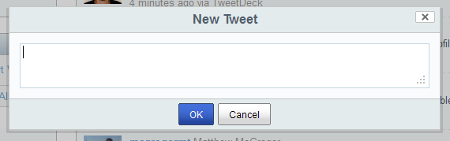

Twitter dashlets for Alfresco Share
===================================

Author: Will Abson

This project defines three custom dashlets which you can use to interact with Twitter from within Alfresco Share.

**The dashlets require Alfresco 4.0 or greater, plus the [Share OAuth add-on](https://github.com/share-extras/share-oauth), version 2.3.0 or greater.**

The *Twitter Feed dashlet* displays recent Tweets from a Twitter user or list of your choice.

The *Twitter Search dashlet* displays the results of a Twitter search in real-time, using the Twitter search API.

Last but not least, the *Twitter Timeline dashlet* allows you to view your own Home timeline, mentions, favorites and direct messages.

You can view messages in the dashlet, and the standard _Favorite_, _Reply_ and _Retweet_ actions are available, as well as the ability to post a new Tweet.

Installation
------------

**Before installing the dashlets please ensure that you have installed the [Share OAuth extension](https://github.com/share-extras/share-oauth), version 2.3.0 or greater.**

The dashlets are packaged inside a single file for easy installation into Alfresco Share. You can choose to install using an AMP file or a JAR file.

  * **To install the AMP file** (recommended), please use Alfresco's [Module Management Tool](http://docs.alfresco.com/4.0/index.jsp?topic=%2Fcom.alfresco.enterprise.doc%2Ftasks%2Famp-install.html).

  * **Or, to install the JAR**, simply drop the `twitter-dashlets-{version}.jar` file into the `tomcat/shared/lib` folder within your Alfresco installation, and restart the application server. You might need to create this folder if it does not already exist. See [Troublshooting](https://github.com/share-extras/share-extras.github.com/wiki/General-Installation#troubleshooting-jar-installation-problems) if you have problems.

Building from Source
--------------------

The dashlet is packaged as a single JAR file for easy installation into Alfresco Share.

An Ant build script is provided to build a JAR file containing the custom files, which can then be installed into the 'tomcat/shared/lib' folder of your Alfresco installation.

To build the JAR file, run Ant from the base project directory.

    ant dist-jar

The command should build a JAR file named `twitter-dashlets-<version>.jar` in the `build/dist`' directory within your project.

To deploy the dashlet files into a local Tomcat instance for testing, you can use the `hotcopy-tomcat-jar` task. You will need to set the `tomcat.home` property in Ant.

    ant -Dtomcat.home=C:/Alfresco/tomcat hotcopy-tomcat-jar
    
Once you have deployed the JAR file you will need to restart Tomcat so that the additional resources are picked up.

Usage
-----

  1. Log in to Alfresco Share and navigate to your user dashboard (the Twitter Feed and Twitter Search dashlets can also be placed on a site dashboard).
  2. Click the _Customize Dashboard_ button to edit the contents of the dashboard and drag the dashlet into one of the columns from the list of dashlets.
  3. For the Twitter Feed and Search dashlets, use the _Configure_ button to change the feed displayed (you can specify any Twitter username on its own, or any list belonging to a user as _username/listname_.) or the search term used.
 4. For the Twitter Timeline dashlet click the Connect button if you have not previously done so. Once you have authorised the application you will be redirected to your user dashboard.
 
 
Known Issues
------------

### _Could not connect to Twitter as OAuth support is not available. Please contact your administrator._

This status may be shown in the Twitter Timeline dashlet, which requires authenticated access to the Twitter API, if the [Share OAuth](https://github.com/share-extras/share-oauth) add-on is not found. You must ensure that you have installed the Share OAuth JAR file inside the `WEB-INF/lib` folder of both the repository and Share webapps.

Credits
-------

Connect and disconnect icons from LED icon pack by [LED 24](http://findicons.com/icon/178350/connect)